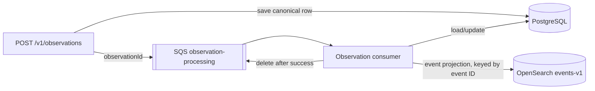

# Data models and storage

PostgreSQL is the canonical store for observations and events. SQS carries work
notifications, and OpenSearch contains a rebuildable search projection of events.
An observation ID is the link between the API request, the database row, and the
SQS message. An event ID is the link between PostgreSQL and its OpenSearch
document.



## PostgreSQL

The `events` and `observations` tables are managed by Flyway. Their rows are the
source of truth used by the API and processing logic. Coordinates are stored as
ordinary `double precision` latitude and longitude columns; no vector or
OpenSearch-specific data is stored in PostgreSQL.

### `events`

| Column | Type | Meaning |
| --- | --- | --- |
| `id` | `UUID` | Stable event identifier and OpenSearch document ID. |
| `title` | `TEXT` | Event title derived from the first matching observation. |
| `latitude`, `longitude` | `DOUBLE PRECISION` | Representative location captured when the event is created. |
| `started_at` | `TIMESTAMP WITH TIME ZONE` | Earliest observation time in the event. |
| `last_observed_at` | `TIMESTAMP WITH TIME ZONE` | Latest observation time in the event. |
| `created_at` | `TIMESTAMP WITH TIME ZONE` | Row creation time. |
| `updated_at` | `TIMESTAMP WITH TIME ZONE` | Last event update time. |

The time range is ordered (`last_observed_at >= started_at`). An event can have
many observations through the `observations.event_id` foreign key.

### `observations`

| Column | Type | Meaning |
| --- | --- | --- |
| `id` | `UUID` | Stable observation identifier. |
| `text` | `TEXT` | Report text submitted to the API. |
| `latitude`, `longitude` | `DOUBLE PRECISION` | Report coordinates. |
| `observed_at` | `TIMESTAMP WITH TIME ZONE` | Time at which the report was observed. |
| `event_id` | `UUID`, nullable | The event assigned by matching; an observation belongs to at most one event. |
| `processing_status` | `TEXT` | `PENDING`, `PROCESSING`, `PROCESSED`, or `FAILED`. |
| `created_at` | `TIMESTAMP WITH TIME ZONE` | Row creation time. |
| `processed_at` | `TIMESTAMP WITH TIME ZONE`, nullable | Completion time for a `PROCESSED` observation. |

An observation starts as `PENDING`. A successful consumer run assigns its
`event_id` and marks it `PROCESSED`; the database constraint requires both an
event and `processed_at` for that status. Processing retries remain idempotent.

## SQS

The `observation-processing` queue is a work transport. Its message does not
duplicate the report data:

```json
{"observationId":"09f4e4f1-6d4c-4ec8-9f8a-4b6dc1f4ef15"}
```

| Resource | Contents | Purpose |
| --- | --- | --- |
| `observation-processing` | `ObservationMessage { observationId }` | Tells the consumer which PostgreSQL row to process. |
| `observation-processing-dlq` | Failed queue messages | Receives messages after the configured retry/redrive limit. |

The consumer acknowledges (deletes) a message only after database processing and
OpenSearch indexing succeed. A duplicate delivery is safe because matching and
status transitions are idempotent.

The HTTP request and response DTOs are transport models only. `CreateObservationRequest`
is converted into the PostgreSQL `observations` row, and `EventResponse` is assembled
from PostgreSQL events and their observations; neither DTO is stored in SQS or
OpenSearch as a whole.

## OpenSearch

The `events-v1` index is a rebuildable projection. Each document uses the
PostgreSQL event UUID as its OpenSearch document ID:

| Field | OpenSearch type | Meaning |
| --- | --- | --- |
| `title` | `text` | Event title used for the event projection. |
| `location` | `geo_point` | Object containing `lat` and `lon`. |
| `startedAt` | `date` | Event start time. |
| `lastObservedAt` | `date` | Latest observation time. |
| `embedding` | `knn_vector` | Configured-dimension text embedding used for similarity matching. |

The embedding dimension and candidate distance, time window, top-K, and minimum
similarity are configuration values. PostgreSQL stores no copy of `embedding`.
The default local embedding provider is deterministic; AWS Bedrock can be
selected for production-compatible embeddings.

## Code locations

- PostgreSQL entities: `api/src/main/java/com/example/wgo/observation/Observation.java` and `api/src/main/java/com/example/wgo/event/Event.java`
- SQS contract: `api/src/main/java/com/example/wgo/observation/ObservationMessage.java`
- OpenSearch projection and mapping: `api/src/main/java/com/example/wgo/search/EventIndex.java`
- Database schema: `api/src/main/resources/db/migration/V1__create_observations_and_events.sql`
