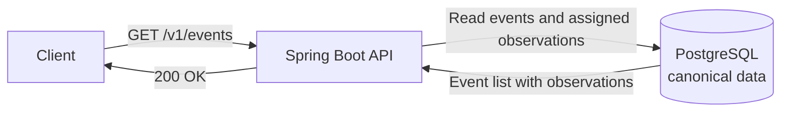

# GET events flow (simple)

```mermaid
flowchart LR
    Client[Client] -->|GET /v1/events| API[Spring Boot API]
    API -->|Read events and assigned observations| DB[(PostgreSQL<br/>canonical data)]
    DB -->|Event list with observations| API
    API -->|200 OK| Client
```
