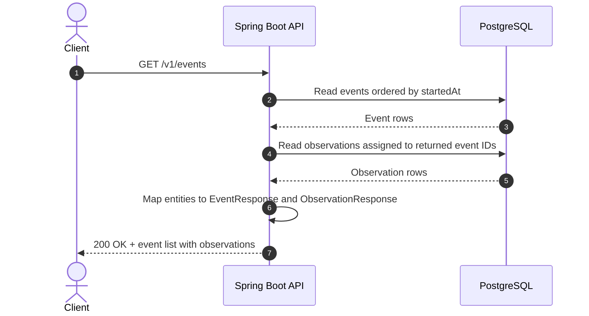

# GET events flow

The API reads the canonical event records from PostgreSQL and includes only the
observations assigned to those events. This request is synchronous and does not
poll SQS or query OpenSearch.

## Systems involved

- **Client** — requests the current event list.
- **Spring Boot API** — exposes `GET /v1/events` and maps entities to response DTOs.
- **PostgreSQL** — supplies events and their assigned observations in canonical form.

## Flow

OpenSearch is not part of this read path. It is used during asynchronous
observation processing to find candidate matches; PostgreSQL remains the source
of truth for the response.
