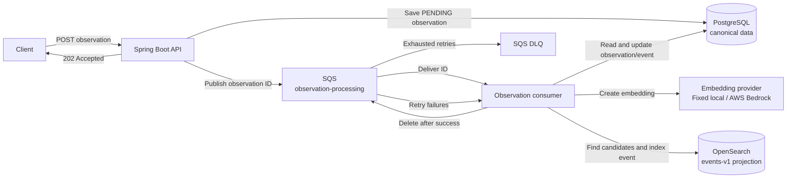

# POST observation flow (simple)

```mermaid
flowchart LR
    Client[Client]
    API[Spring Boot API]
    DB[(PostgreSQL<br/>canonical data)]
    Queue[SQS<br/>observation-processing]
    Consumer[Observation consumer]
    Embeddings[Embedding provider<br/>Fixed local / AWS Bedrock]
    Search[(OpenSearch<br/>events-v1 projection)]
    DLQ[SQS DLQ]

    Client -->|POST observation| API
    API -->|Save PENDING observation| DB
    API -->|Publish observation ID| Queue
    API -->|202 Accepted| Client

    Queue -->|Deliver ID| Consumer
    Consumer -->|Read and update observation/event| DB
    Consumer -->|Create embedding| Embeddings
    Consumer -->|Find candidates and index event| Search
    Consumer -->|Delete after success| Queue
    Queue -->|Retry failures| Consumer
    Queue -->|Exhausted retries| DLQ

```
