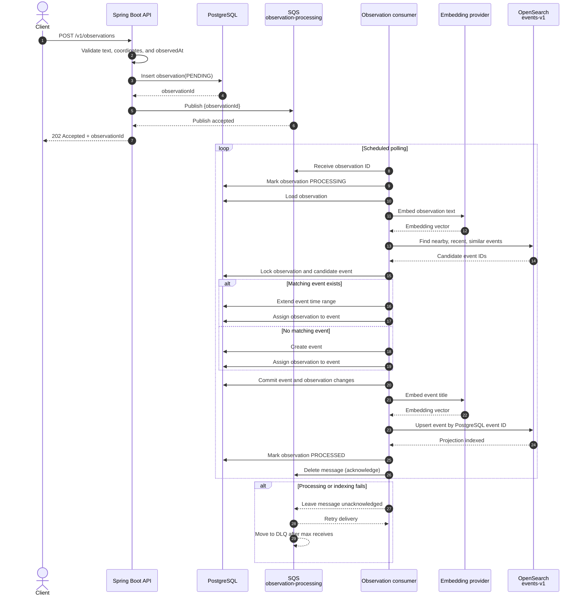

# POST observation flow

The MVP accepts an observation, persists it as `PENDING`, publishes its ID to SQS,
and processes it asynchronously. PostgreSQL is canonical; OpenSearch is a rebuildable
event projection.

## Systems involved

- **Client** — submits observations.
- **Spring Boot API** — validates `POST /v1/observations` requests.
- **PostgreSQL** — stores observations, events, processing state, and the observation
  to event assignment.
- **SQS** — transports observation IDs through `observation-processing` and retries
  failed deliveries through its redrive policy and DLQ.
- **Observation consumer** — polls SQS, coordinates matching, projection, state
  changes, and message acknowledgement.
- **Embedding provider** — uses the fixed local provider by default and AWS Bedrock
  when configured.
- **OpenSearch** — retrieves event candidates and stores the `events-v1` projection.

## Flow

The database commit and SQS publish are separate operations in v0.1. A successful
database commit followed by a publish failure can leave a `PENDING` observation without
a queue message; the MVP accepts this gap and does not add an outbox.
